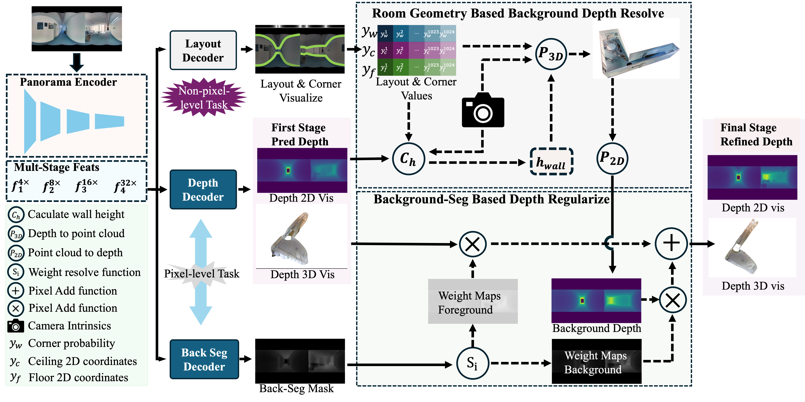

# An End-to-End Room Structural Regularized Depth Estimation Framework for Indoor Panorama Images

This is the implementation of our "An End-to-End Room Structural Regularized Depth Estimation Framework for Indoor Panorama Images".

## Method Overview

    

 

### Abstraction
Predicting spherical pixel depth from monocular $360^{\circ}$ indoor panoramas is critical for many vision applications. However, existing methods focus on pixel-level accuracy, causing oversmoothed room corners and noise sensitivity. In this paper, we propose a depth estimation framework based on room geometry constraints, which extracts room geometry information through layout prediction and integrates those information into the depth estimation process through background segmentation mechanism. At the model level, our framework comprises a shared feature encoder followed by task-specific decoders for layout estimation, depth estimation, and background segmentation. The shared encoder extracts multi-scale features, which are subsequently processed by individual decoders to generate initial predictions: a depth map, a room layout map, and a background segmentation map. Furthermore, our framework incorporates two strategies: a room geometry-based background depth resolving strategy and a background-segmentation-guided fusion mechanism. The proposed room-geometry-based background depth resolving strategy leverages the room layout and the depth decoder's output to generate the corresponding background depth map. Then, a background-segmentation-guided fusion strategy derives fusion weights for the background and coarse depth maps from the segmentation decoder's predictions.  Extensive experimental results on the Stanford2D3D, Matterport3D and Structured3D datasets show that our proposed methods can achieve significantly superior performance than current open-source methods. 

### The Pretrained weights of our model will be released soon....

### The training code of our model will be released after our paper be accpeted..

